# Radix Sort in JavaScript


# Intro
Radix Sort is a unique and interesting sorting algorithm, because it sorts arrays without making any comparisons between elements.

In this article we will cover:

-[What is Radix Sort?](#what-is-radix-sort)
-[Radix Sort algorithm – step-by-step](#radix-sort-algorithm--step-by-step)
Radix Sort in JavaScript
Time complexity of Radix Sort
Advantages and disadvantages of Radix Sort
Summary: Radix Sort table of properties
## What is Radix Sort?
Radix Sort is a unique sorting algorithm because it never makes comparisons between elements. It exploits the fact that information about the size of a number is encoded in the number of digits - more digits means a bigger number.

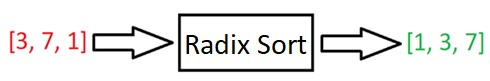

Radix Sort takes a list, and puts it in order.

<b>What does Radix mean? </b>The Radix of a number is simply the base of a number.

For example, in life, we usually deal with base 10 numbers: 0-9; each number can be one of ten possible unique digits. So these numbers have a radix of 10.

If you were working with binary numbers, then each number can only be one of two digits: 0 or 1. These numbers have a radix of 2.

If working with the English alphabet, each letter has a radix of 26: each letter can be one of twenty-six symbols (a-z).

Radix Sort can be applied to data that can be sorted lexicographically; e.g., numbers, letters, words, or playing cards – all of which can be put into a specific order.

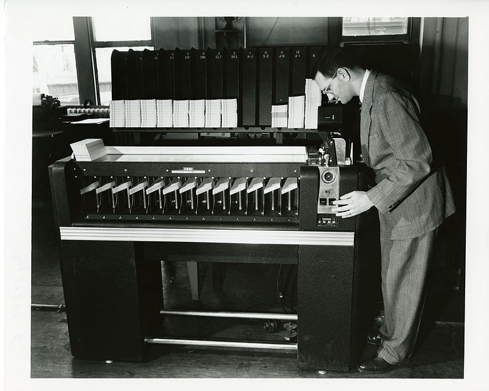


IBM's card sorter used Radix Sort!

Radix Sort is generally implemented as an out-of-place algorithm, since it needs to create a second, copied array in the sorting process.

Radix Sort works through an array of numbers one number at a time; this means that equal numbers (e.g. 10 and 10) will remain in the same relative order as they were in the input array. Therefore, Radix Sort can be classed as a stable algorithm.

If you don't know why it can be important to know the stability of an algorithm, check out Important Algorithm Concepts | Algorithm Stability, In-place Algorithms, and Comparison Algorithms.

## Radix Sort algorithm – step-by-step
We will now go over the logic and steps of Radix Sort.


Every number is composed of digits. For example, 108 is composed of three digits: 1, 0, and 8.

Every digit in a number can be one of ten numbers: 0, 1, 2, 3, 4, 5, 6, 7, 8, 9. These are called “base 10” numbers.

If we were working with binary numbers (base 2 numbers), then every digit could be just one of two numbers: 0 or 1.

Usually, we will be working with base 10 numbers, so we need to create ten “buckets”:

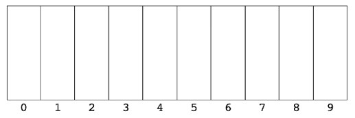 

Ten buckets for Radix Sort
Image source:
We will now go through a Radix Sort example step-by-step.

Let’s say we wanted to sort the array [1556, 4, 3556, 593, 29, 86, 7].

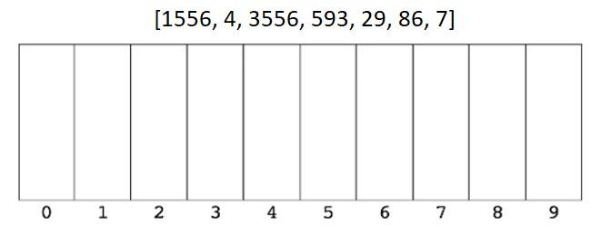 

We first look at the right-most digit of each number, and place each number in the correct bucket.

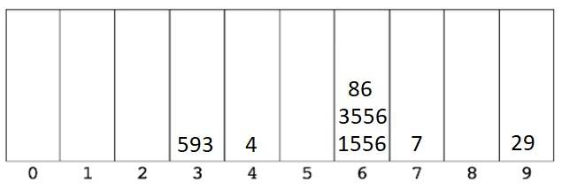 

We then put them back in the new order.

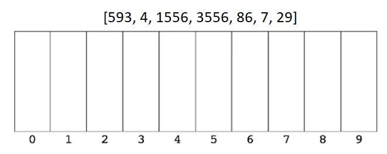 

We then look at the second digit from the right, and place each number in the correct bucket. Notice that 4 and 7 don’t have a second digit; they are the equivalent of 04 and 07 respectively.

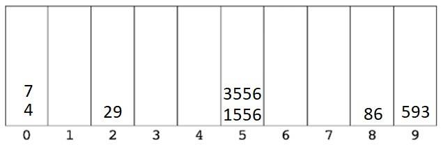 

We then put them back in the new order.

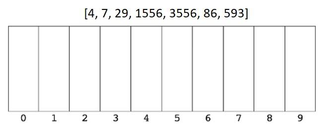 

We then look at the third digit from the right, and place each number in the correct bucket.

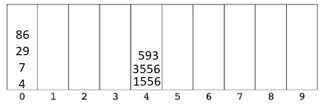 

We then put them back in the new order.

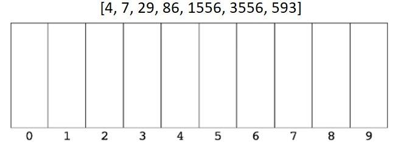 

We then look at the fourth digit from the right – our final digit – and place each number in the correct bucket.

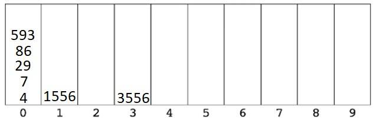 

We then put them back in the new order.

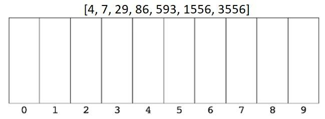 

And that’s it. The array has been sorted and not a single comparison between numbers was made. Radix Sort is a very cool sorting algorithm!

## Radix Sort in JavaScript
Before we implement our Radix Sort function, we’ll first need to define three helper functions.

### Helper 1: getDigit()
Our first helper function, getDigit(), takes a number and a place; for example, if the number is 354 and the place is 1, then getDigit returns 5 (4 is at place 0).

Using Maths.abs() allows us to work with negative numbers.
```js
function getDigit(num, place) {
  return Math.floor(Math.abs(num) / Math.pow(10, place)) % 10
}
console.log(getDigit(43263, 0)) // 3
console.log(getDigit(43263, 1)) // 6
console.log(getDigit(43263, 2)) // 2#
```
### Helper 2: digitCount()
Next, we need to write a function that counts how many digits are in each number; for example, 344 has three digits, and 2 has one digit.

This allows us to find how many times we need to put numbers into buckets. If the longest number in the array is 4 digits, then we need to put the numbers into buckets four times.
```js
function digitCount(num) {
  if (num === 0) return 1
  return Math.floor(Math.log10(Math.abs(num))) + 1
}
console.log(digitCount(0)) // 1
console.log(digitCount(21)) // 2
console.log(digitCount(3547)) // 4
```
### Helper 3: mostDigits()
Our final helper function will take an array of numbers, loop over them and keep track of the digit count of the largest number:
```js
function mostDigits(nums) {
  let maxDigits = 0
  for (let i = 0; i < nums.length; i++) {
    maxDigits = Math.max(maxDigits, digitCount(nums[i]))
  }
  return maxDigits
}
console.log(mostDigits([44, 849, 1, 3333])) // 4 (because 3333 has four digits)
```
### Radix Sort implementation
#### First, the Radix Sort pseudocode:

Define a function that accepts an array of numbers.
Find the number in the array with the most digits.
Loop from k = 0 up to this max digit count.
For each loop iteration:
Create an array of ten empty arrays: [[], [], [], [], [], [], [], [], [], []] - a bucket for each possible digit, from 0 to 9.
Put each number in its corresponding bucket based on its digit at the kth place.
Replace the existing array of numbers with the values in the buckets, starting from 0 and going up to 9.
Return the ordered array at the end.
```js
function radixSort(arrOfNums) {
  let maxDigitCount = mostDigits(arrOfNums)
  for (let k = 0; k < maxDigitCount; k++) {
    let digitBuckets = Array.from({ length: 10 }, () => []) // [[], [], [],...]
    for (let i = 0; i < arrOfNums.length; i++) {
      let digit = getDigit(arrOfNums[i], k)
      digitBuckets[digit].push(arrOfNums[i])
    }
    // New order after each loop
    arrOfNums = [].concat(...digitBuckets)
  }
  return arrOfNums
}
console.log(radixSort([1, 33, 444, 0, 3, 2])) // [0, 1, 2, 3, 33, 444]
```
## Time complexity of Radix Sort
The runtime of Radix Sort depends on the number of digits in the longest number, k, and the length of the input array, n.

For clarity, if the input array is [22, 6544, 894], then k = 4 and n = 3.

For every loop iteration up to k, we have to loop over all of the numbers in the array; therefore, the time complexity of Radix Sort is O(k * n).

The time complexity of Radix Sort will always be O(k * n) - It doesn’t matter whether the input array is almost sorted, “randomly” distributed, or completely in reverse.

<b>

Radix Sort best case: O(k * n)

Radix Sort worst case: O(k * n)

Radix Sort average case: O(k * n)
</b>

## Space complexity of Radix Sort
The space complexity of Radix Sort is O(n + d), where n is the length of the input array, and d is the amount of numbers each digit could be – in our case, 0 to 9, so d is 10.

Where does d come from? From the fact that we have to create an array of “buckets” at length d.

And n comes from the fact that we have to store each number in a bucket.

## Advantages and disadvantages of Radix Sort
Radix can outperform efficient comparison sorting algorithms, such as Merge Sort and Quick Sort, which have best-case time complexities of O(n* log(n)) – if k is less than log(n).

However, Radix Sort isn’t comparison-based, and uses buckets instead. This means that if we wanted to sort strings or floating-point numbers, then we’d need to tweak our Radix Sort function to account for this; for example, if we were sorting strings alphabetically, we’d need 26 buckets – one for each letter of the alphabet – instead of 10.

Compare this to Merge Sort or Quick Sort in which we can throw strings, numbers, or floats and it will sort them without the need to make modifications. Comparison-based sorts are more flexible; Radix Sorting is more specialized.

Another disadvantage of Radix Sort is that it takes up more space in memory than Quick Sort or Merge Sort, which have space complexities of O(log(n)) and O(n) respectively, compared to Radix Sort’s O(n + d).

For these reasons, Radix Sort isn’t as widely used as Merge Sort or Quick Sort.

## Summary: Radix Sort performance table
Radix Sort performance table

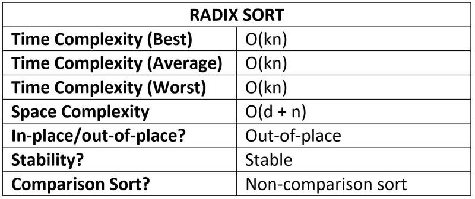

If you enjoyed this post, subscribe to my newsletter. I write on topics such as algorithms, UI design and freelancing. I’ll email you once per week with my latest article and bonus tips and tricks. I like to dive deeply into topics to give you all the information you need in one place!

And if you want to further your knowledge of algorithms and data structures, check out: . It’s the best Udemy course I’ve ever taken 👌.

Thanks for reading,

Have a great day!
--------
source: https://www.doabledanny.com/radix-sort-in-javascript